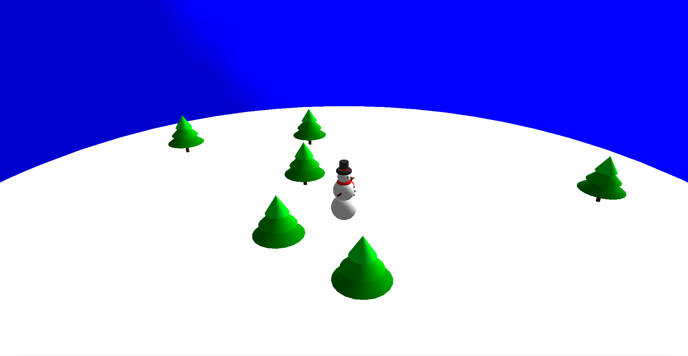

# Snowman

**Requirements**

```
sudo apt install freeglut3-dev
```

Compile the code

```
g++ *.cpp -lGL -lGLU -lglut -o teste
```

Run the code

```
./teste
```


## **Final Project Images**





| Key | Function |
| --- | --- |
| Arrow Keys | Camera |
| F1 | Zoom out | 
| F2 | Zoom in |